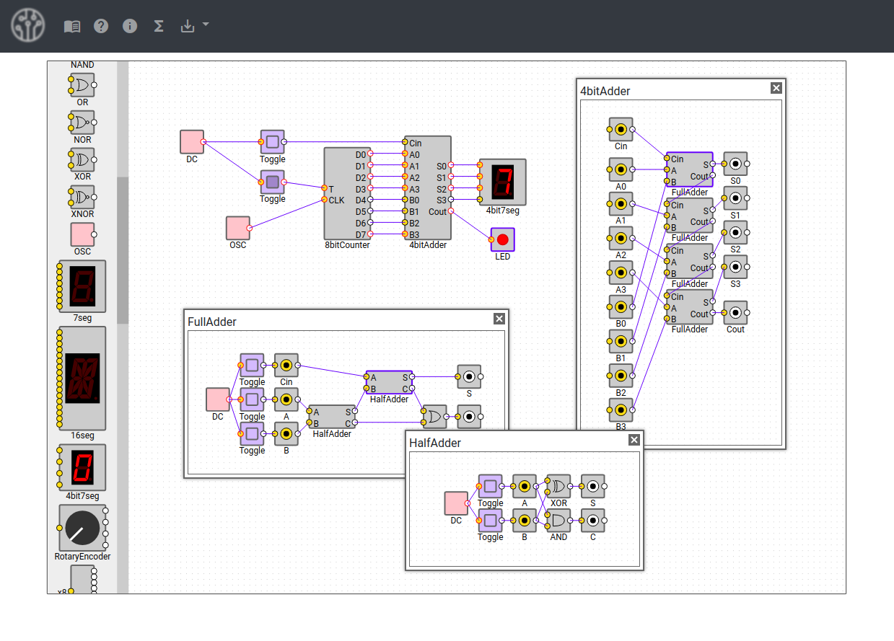
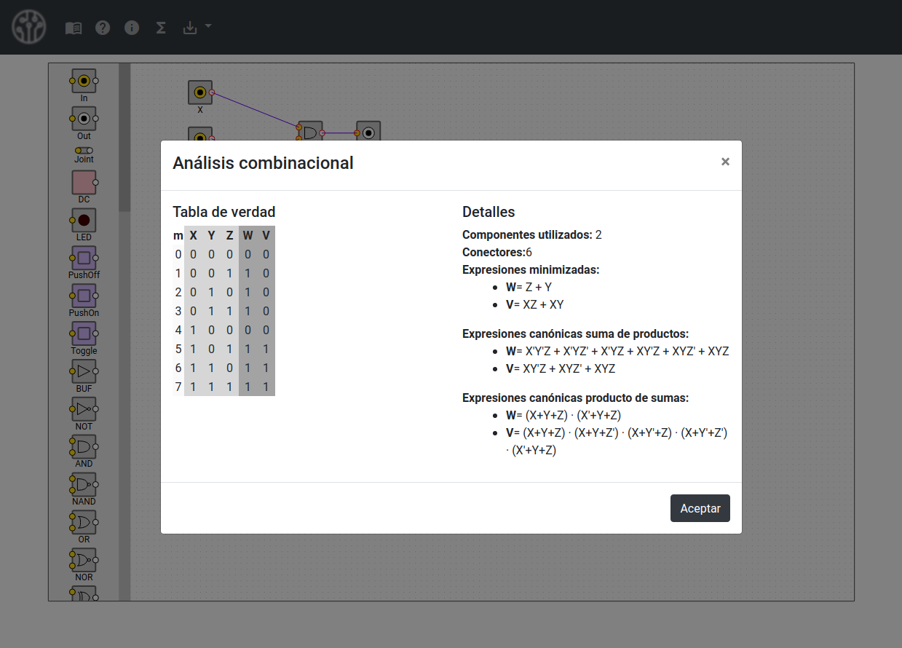

# SimCirJM

Una simple GUI en Bootstrap para SimCirJS que permite compartir simulaciones por url, importar/exportar mediante archivos y analizar circuitos combinacionales.

  
  

## Ejemplos

De la carpeta [doc](doc) se pueden descargar los ejemplos o siguiendo los siguientes enlaces:

  1. [Combinacional simple](https://matiasmicheletto.github.io/simcirjs?model=a73a3833973c7f5e95f99f5169543ee9a04b958c6de995a299b7df6399a46cefkYrGmkl29tBpCSaRaJxTBIuuTzN1rio7wgaGn9i%2BRjuHJZk%2Fm4jBnbM%2BbBqoan7UqAm5ekH9ytkkLjDdaZEHj7Raf%2BkokHsaMOfjU06eA2W4TXAfKIXe6pRqRhfoaSt%2BivwC3FKPoXSyRSdZkd6fQQ8pqb6AWRhxgEOuAFDEfM9Nbte%2FGJDc5svBV4MXJqa2bPdTQ8txX3Ui55tVf%2FmhS3ZGvOXpWffHw%2Fzu%2BNXP2POcokcvq2vTvmI3vtuv6pur70Fk9SpzlGZaQYKQ6nokN%2B2QtfyNd1MieJyIDSafRcYQ%2BndF%2Fw5At4BJtkMxTO6mH0Nbwah7gFCVRXRmUkiFQQ40pZYzx6f5PaEM%2BmQBYs%2FCmAGhXN4cLurhJZKQvtUVf4wFkBY9U%2BXC3QgySZOaQLtarMRyFC0QTVOa6s%2FBRBnUHxTckvhfqF%2Be80M7aNVS5GGAQ1I3oYcoCJWVGKhAsbTVtKSNhjoKxI0ttp6JshbXkaD4EecdU5Q86nGwiJAQOS4EtJYeooYR5hhjnZL3DVrEubUV2Bpj%2FnGaRYROiyzVAtnFVDRrfWPBQstZuRopitTAUgEkVwVNAuSlzDWRuMRfZ%2Fkz7HkrtZLzONeNgiFtG8WAsTp6SvpGNJNvfi6O9cgwwG6Nc%2Fgqs1t2kVdF7xljyc3ma%2Fme%2F4Aw4KS%2Bh2KddqA3DCHydpfvL7wqWK3h79R37%2F3Dp8HCMyRXO2HYHgr4QGGCWVfq%2BFFnDg5UocTuODn7Gph7Z2y8VnPpHNCOP1O9I01XuSsd%2BDXROF4Atwg1tyce%2By3dzoP5RImL713TALIFd2l0pcBxoqL2dvtEjC9zt7LEkp92ACW4MEBFH45D1zA2fub%2FZuwFfAB4Yu7r1nkrTQZ%2BNYXLfKhjnnnlAymvxzMtMvZhMe5CRHrfMA%3D%3D)  
  2. [Secuenciador de audio](https://matiasmicheletto.github.io/simcirjs?model=5dc2ab622da3c50861681aa85a0b9d3664d82547a09cd9016f390e4f97d856fb1G3%2BgLcBdobhpcHyYoYbiMaSnA1KgKeLR1nlu6IGRfG448MSZT9iPcVQqn4T0dbvSa94Zwur0yoG5cuuFQDI9MIbLZrW0czIOsapenxdpP3c4vLJ8he%2FlKVWIT%2FNJ0KmqGPl24%2Bo%2BHgwLjbpibTXX%2F9C0L0IHAxA%2B6RrdYHbZ9bi34lAMxGbYgwdxwZc3za6nxNRbfFheztoaeakbcJuveyO3wI%2F%2FgIZWt9UIr84Yc8PPGPQQIZVyEInyNPprNkHDhi5WFOg27m9ghxk9rSTA2K2XmdjL%2BO37gd96MEsN29yGRXkMTW3H0JBvH8vjVRFz%2BuTJYG%2FX8irJb2hBHH9yql2JkoXSSyL0mrx6aDzjVhqWLACUh2JnXLqa8kiNrJNOFGDGLpEuV%2FTeQfQNFq8J0IbdtzEZy4YzXCU%2BF0oOzYnv6jl%2F90Xh%2BHC5zHrFhI6iyPijFiAenQtgTzEhdzQCqgLbyrGoD0D%2Bch7%2FbHu629dh25mIju0kitGhgNmqnE9IdD2VtztxOJa5e8963zyYxRj5OoESP%2B1qlK7oYB%2FZGDvjSB16A7tASJMOD%2Br%2Fz41xbVFkHnnRTIJWh6%2B8rfKYe1To3uB43IC56iXKuYj%2FeXq7ankpk0NX9yEFtrqCNivyRDzu0HVWgRC5Hm350pRVQ%2BgV6STdzPRso6huk1aFw6jLo%2Fsvrx9D%2B8gqi7trfdIkhzCYYY6cw3CV3pg1tYXMbng0gI6%2B1VZoDu8vNCAw%2BSobXkuPxzm59O8CGtUaC%2BlSU8AOlecHmdOkSOOEujMENrt9mPoem8RFS8MI67%2BgFo41XHg6OL0A2Kr1LmYmNJW1wRUTVtunAoOJ1co2nTAT%2BWbM7jsh2OPSxrSP0pXprp6cRUJqo2LntOc%2FOO1FCuHZ2N7X7Ln0coQ1Ji%2BcA9KruQeImo%2FmSgXuaGcAxlizcIfq4lCrKtq4%2FgaR36MSIT8S8vj6LVFcxn6jBh8f0uZT%2BXwnOuChX59oZxV067vgqLzO7Wk8lSN2BqZgg4SAN4m4rh2GAukE%2BjrdxrIe6J234rtpUmApCQ%2FSatLB58G3kTZXfC0VIlzpfsDQdc4bTHd1vEBdW%2BnBpK3g9I%2BHjXIg938tHibXqaushOjPHxUyPCxMiX7W7e%2FJOnw4qKL0mjV4OKDLLmIVD4vg0oso0Xvs34XhJGgjGbfpoB8jqFu3k%2BuXNq7%2FA6hh4DEPr0GfLeyfKjVC5fXL6zLlTb%2BK%2FzWWCfRAz0PokQZNUXowetQNjFGR16aJt24GwcNn7BnIjZJflbAyVsbepyGiCWtwpU1%2BTBVQqiY2CFGd4Nd6N09roLafyqdKc3s19CTnRhRQ89C%2FGeqJl2WTOszfeTv%2FODgOhZo9A4YmlCUdzE8iM%2BckLpqbMwviCzhooI%2Fy5oPT8kLO5GUp66XhzOgsnnOz%2FyCzBwZxuJitYg3FxOyEIH8HA0L6ae%2Flg1UDA1JOiSgrvLKTNEFdhmDFD%2FwfuG9DWjInW42nxi36jawgU6PPTEs7Yv4w8q0%2FS1Wi7KWSH6SsbhiyYAh1fe%2BsXx0IJh1QkdC63FQMbIQ6v3JpJi%2BNsLzs1LUxGXN%2BcQoHuElo5OLJtHzS0PxpRcOWTgz1DcHYGfvpTSqCKE1AoXL0T1h6RcNtVb271iNNcwYnclJv5%2Fltd7M30e6by75Nf5PFVMXeJiv0dkUpaAWu5unRkxsQBf9hM3iwp08ytMU2Os3893weZZOVan8LC5wctgr09eMRtIekTItkxd7eIuYitMV57R3JnXPNfiFS1SQVlyQW51LjI5uyD%2BLCmY9c3PCTXXT5WD7Z9vXs6HSVAfT0zgAapbm5ChYSBEnsBtqv1DRkjdsGAdsHaPymg%2BsWkWhF%2F4jVUa4oWzxztevw16%2Fh4drNZgX3mH78yns1sZ1BNM7qZVpFJV9SNfiEIfQ%2B8gA6AgObidWkNBwBHmjIoloF69Q9yEXUAjf0pYOixMkl6yP%2Bw1HM42s%2Fs%2BKR7JTKZkFfTNhIlgWPM%2BvZF3YBdVgiq33Dfi5qOKS3V91UjBRMR5siUY4UPPYxWuDi8cRGJiTS2WogeEZ%2BVU02cWcEEbvyzXb4NM7Y1VuMd6B75kLM19FsfUlI4XC%2FbUf1RxRsKYp33X8Mviy3EGmuIf279PTQ1tfcpNxEItoAVRosforDoiO7uP3rHhTNR3GkJHNE1utkCF5alynf28K1%2F3JpeTqFaQOBCuTi0ckSF5X0VTX4Z%2Fz6IWiHzZbMG67jcAGC9dsLsenToz7GV1AJlOjvIc9%2B9z%2Fm3jc3CK%2BUoOKduv0W29xdF6aJMOvCyxJUo8%2F%2BkLteQjpPqZu8n5ii%2BVM0zxRW19H49kmSaaS8FJZxBHNPDQo2e6xCu2PVILEr80Z3fZfzJrwI1KB2N%2FA921jGTNWJ88rVv37ROswd95%2F%2F8kF7eIuiY6r0FDow0IGM%2F3JI94tOY0cSvj%2BD96j4i7HB4sMOxHjxtbtbOqEkoq0VYnjBAWJC%2ByofdMYOymOvLyNcfPpAmyozWdC5fUscqLEUrrse2XQ579aCpxvUMAHJJzfaY3gDcz83FSc70qWE%2BDSRK%2FXaaXKWuFOIo26rd5DGCqHH6RxyznFov3UmCXT5yKUDQzewkgPn30h%2FxnOFjXVmwjMrdcAd3X5TlswHjiFMc5dyZgAp%2Ft04yJCA%2BH2EK1Jch%2F3cClGjNrwHGEbL62McBddXLhGQxf%2BN%2FaffNQW8EHS7yAuVeDGoqiPozbJEhvrWJtxOr9eMOyc3Z4bHFSjtyBJaAbC5v67eKKnNFHIX%2Fn%2BavW4bqGRzP7VFZXD5SreUvl4Z502QOztlEMDNMnI0SKl6pMt4QiPBMPV9TvJ2%2B%2BRbDOiaDISQ6noaIP3ZZT2FwXzxFfj0o%2BUW%2F90Qljmt8nllhmIjj9Mgo7eFg%2BE1Ak1Iap1sIWgyk3jf%2Bf974L%2BsQKdQDiT1lgn%2BcW7v0Ar%2FzrWQ4KMuRJKmQJvonn5fNXJbq7Lo%2F5LDUUZ4Y6R3QQTBL31qvnJP2YbhXaNQ0aGLwsFDZrUH4sMn3%2BKrPFiBQZ7Dbcnqhhwog4rzp6zdtTneKCJTTRQ7AkHsjE4Rq4EZoBqVc8EHGXl6PP%2BzAMJQZhWyAvV4baa1uNQd2SJDhq%2FGyre21FUjV9jeJXKzDStn2FNbdh7jc%2B2cliMy94Wd1qjd0lFoF%2FBFPGUz7Gv8XMVAt0%2BA1oiEXiOsMAqoP4dVSOm%2BUlpIf7BB88hQoumuFuP5%2FygDix6Q7msxGtw5r9Ren6yS53DPEashe%2BnKWdud2lm8LRu6JCR4xYaoEEw5ELAWwZgwBSuHflPNWSUOfU94FMlKbcww0BUMnZGNueAumQVLwoEDn2qvn6QaAOnvDGFkISpAwgbJtHRbcBKrn66jb0bYPlnoe6bftsGtC22asX7BTWZlj5jc12GEF77Ikk5Xj11dKJcImx2ruADrBaidf8Dt%2B85uND4nFJZNTLZrmXkpuzt6Xp%2FlxpebShQiHrZ064yFCRNHCAaF5H939iqVQf69F5JgJqAVl3YcsdFjrmiapmLSumKzphZF4an8oQgFGM8hQxmor9Fx%2F%2FrxgTfjeaRjQoLjuBvFTxtkycbf0K89augz2%2F42H8VNlsheuzC%2BEcxYXhvBbtAvb5NVM%2BRglLwdtzr4V0SGGkUESdH51pdgoXdhi%2FACT6PAB8WKrX%2BSEBQcXqUqPpDb0RcI8sFXrWlMWEvbJcfGfz0wPvvIMxV1ZGs7eGeVg%2Bu1QMDsXCEw6FsBZD5xh1I5fM2rqTPSLmnVh29ZAsHzOpnLHCMQopXqQ03N9elgpZdv4Bs8OP%2FSN8wTvuL%2BficOMlMEasRgXq6F5dN4bOzFkMJRXP%2FBA%2Bd6PMTTkl45YzqYK4hra4wLLeqo6QYbziMf96jTByMRZHsW9Bf5W1cE6P57NXMnzz3eTRM904Ms1OSDlOcfvqYTjuSsVZ8Gsvanl%2FwddlvziOgfw9B%2F0M4eE9VVnFyxBR9Qor2eTAVoz5hftnk4yoC%2FywV8RHI8EuKmy38%2FQ0YCtukOEPLbZ8WyoBEHQe70rB%2F%2BtDWDn8DqU9Q9yNqb89Xco%2FBDh2q1blkfW355ES6klpQ8PVl%2B59E1%2FQFz%2FYYf3ANLYvivxHDP6PSUCTBq4kkxYmOX66y9BXqz4P0yQkz8PDb%2B5%2FM8%2Bdi6i9xbCgH1A8YPlkiXAd91CVzj76ldMBiRGJ1bzDCQPn8zRGxFs1mbcmU1j%2Bb7sVYA3A2jTKWKqrpCOHI5%2FhWyCgWf2D%2BM3mIRpWRmV270rCCdAx%2FSMOZY67IX4ylqECiSYv30i8PviyZfGtulbd%2BJ6eP7qhVQ3vhTisD%2Fbwmdq1UzMeT9pE7n4W9c3sObZWc6aC5qWHYnW5k3mO37rUJa7Ry2rptxeZiCbtYfpYUC7eryn8d4SBvMMeSR%2BxS%2B8SYvdKYgw2F3TdqSj068Jr9fqddJRW2LSOt%2BB%2FgvfkW7tGBLYrPG01SfYon94AwDnYux6htUSjb65FqJHqPLHYZobGK%2FPAZjaI2MECqyFB31M%2Bm2YzSp3ynJjrPL6JNmdVUlsRYxmm9PxLRIfM6zMd1ymS%2BYVV1sewK%2B0ivkYfcC4etfj10N5rHbjjQ33ELTHgk)  
  3. [Sumador completo](https://matiasmicheletto.github.io/simcirjs?model=b9d48b4863b0676fb1ada6fa58c6f517a6eb968248e189f1a31ca7a49839e7d96uJIPMLzaPIBVVBd8SCsbMbUtyzUowZSGcRuEc0q0Nvadel4v4uJgekbd3UeZCym46tqA6IbWQfBTdjD6c5B6NsqAtzeXi7OjUrc%2B%2BN3r5XMqzOLEHlFoFwYo%2FtPJZFX%2FVv2CwWXgGXPj%2FhbOKtbncuLl3XfhJTwJSlzpBNC42jc9%2FUYEre52kgnDzcastwQPtIHmfl%2FQPM32y8Q20Kw2X79DGRr4tmHLtjz21b9xZh3ZfRg7dxd%2BKWiOSRsZJNasrSKHadCHHaimJacUzwqvw%2BJkdR7DNET86keiy%2FMVWoATOum2I%2FHE2MKtAxfrwQzw1lGafTNUDKhdDhlW7QbeNAovsBr4cKUII294bfigD5WJRwkwlD%2B2JweaKB%2BVH64B%2BxrUUwR8SAOZ5JapSPZx%2F0bxVRWRlc1vmVadEthbW%2F3GrdJuRplRa2M7OM6SNd1evoBidB33V5d%2BFTWkbWO6cW10L%2Fun%2BNCiczl3cLovUHqKW0CJyRpH%2BSLrtdYrQyj6oo2j4%2FiFa3N6W9Yvj4rseDluqo2BIzO3Pb3TJZPRz6UAhGduPQ1H%2F1BJnlEsNjQjdtQ4nLswtvrxa9IeTtDCG0hAhehAT1BfhrOAgP3ldwyhy9oxTpUPsyMMtnnmI%2B5bvWFtLqDLR0ev0g0fu2Lk5masPPhQaTxCwptLdi7gBiwo%2B0%2FN3Y5ojoJkGTw7w7ISTnTn%2Bwol5a098Fk8RsgnVml0MxhYlp9NFFTmvyYHVFB2INeAWTf0NDl3FY3bMllgKBwzWCkpFvRdkmK1AsAsYalHTPwKO47GQUIhuTCboyOLRltDtfTHe%2FkIyzQzdLCzTplQu3%2BymGOeUObO%2BQ7N8acYKBhISGJigfd6jyQ5eSu7UIi4AhXzFQpJqwSn0tkUOB5rOPw%2FKaR7vMHlzoePbRLCad1WY7n2GOWhU7TYcs2yAWqze2oWxbyzq9FtdD52OH3UJ8PJ4qEXIO%2FIKTlTmYcZxfQr61USzMvnsTHRe3AQx4g3QCYuVoapb%2FSXdpyAOWnosnzYoFoayWWJZ%2BXEjmCfTU2iPjWIQtpjAkTxnjfmDao7JUT%2Bl00%2BUiGP98As%2BW2DKqDvF9rRZQF6r%2BWXrR1j%2Bn6yFJQhmARlMxMrU2d0LZaCEEc2hAgVXWXzo%2FMsv%2FWhoMYpxvC2P6ouG3jHF0Gwx5zKE%2FvtMEAjg%2FPUnnH%2BMih4bG6kzSn9ij7J1gweijX4WjeAQkCUT2PTCw0NS3InLnd2h3F9n0Au3SSpwACTYl1js5pvyKbOSLGIghBm0tcIjF4VsNh5ECfGYa%2FXbZGKXvT6uloN0k7rv4xl6PmhfDQSoCUKKlWU2GO%2FyIBO8YESwqVHy46soIUPBBF%2FevhWKzAr77c9LTIxS9IpJwOPAb2NEsCfxr4KBGJjOwiN088403skn3MPuNllNPhBtmMgfvWM3rm%2B7Ma5gIJ4IjLnOf7t3EQoH65PhtaT3AuKUeUMyMYI%2Fy4B7%2BD%2FL73sR9%2F8NzNaTini9WMXqi7Xtux08xJ2hHOWqUE%2Btmzwy5ELCPB9xirx8MZHOrk2SjaGSpW0i%2FRWmiMYCuCptAI1tNRgcAxKMtUlHrwPXW35MPr%2BVw5K1gG1OR63bm8lvhSo6M3N4qgX84OMkkFVNTDAoezYpnXMMQgQGT1Y9jg36MojVl%2BqqvH%2FxrHo%2FDzHpAaTQ%3D%3D)  

  ## Implementado con

| Librería | Documentación | Función |
-----------|---------------|----------|
| SimCirJS  | https://kazuhikoarase.github.io/simcirjs/ | Simulador de circuitos digitales. |  
| Bootstrap | https://getbootstrap.com/docs/4.1/ | Componentes de la GUI.  |  
| JQuery | http://jquery.com/ | Dependencia de Bootstrap y SimCirJS. |  
| Tone | https://tonejs.github.io/ | Generador de audio para el simulador. |    
| ToastR | https://codeseven.github.io/toastr/ | Popups |
| SimpleCrypto | https://github.com/danang-id/simple-crypto-js | Encriptador para compartir modelos por url |